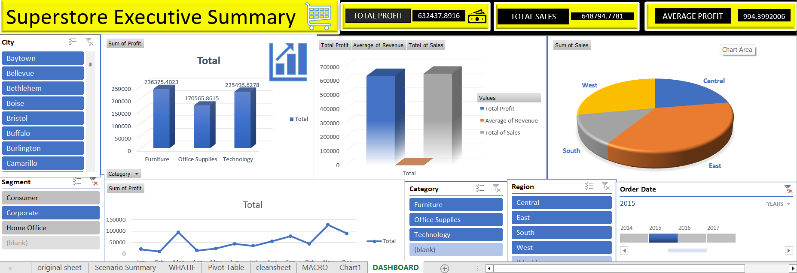

# 📊 **Excel Project**

## 📘 **Overview**
This repository contains an Excel-based project demonstrating structured data management, formula application, and basic analytics using Microsoft Excel. The file **`EXCEL_PROJECT_NITHISH.xlsx`** showcases organized datasets, calculations, and formatted outputs suitable for learning or professional use.

# 📊 **Excel Project Dashboard**

## 📂 **Project Structure**
- **EXCEL_PROJECT_NITHISH.xlsx** — The Excel workbook containing the dashboard, datasets, charts, KPIs, and calculations.

---

## 🔍 **Purpose & Features**
This Excel dashboard project is designed to:

- 📁 Consolidate raw data for meaningful analysis  
- 📊 Provide interactive visualizations (charts, tables, KPIs)  
- 📉 Track and display key performance metrics clearly  
- 📈 Help users make data-driven decisions  

### ⭐ **Key Features Included**
- 📌 **KPI Tiles** — Highlight important business metrics at a glance  
- 📈 **Trend Charts** — Line/bar charts showing performance over time  
- 📊 **Category Breakdown** — Pie/bar charts analyzing categories  
- 🎛️ **Dynamic Filtering** — Drop-down filters or slicers for drilling down into segments  
- 🔄 **Auto-Updating Visuals** — Charts refresh when data changes  

---

## ⚙ **How to Use**

### 1️⃣ **Open the Workbook**
Open **EXCEL_PROJECT_NITHISH.xlsx** in Microsoft Excel (preferably Excel 2016+ for best compatibility).

### 2️⃣ **Enable Content**
If Excel prompts with warnings:
- Click **Enable Editing**
- Click **Enable Content** (important for macros/pivots)

### 3️⃣ **Explore the Dashboard**
- Use **filters / slicers** to switch between views  
- Navigate between sheets (Dashboard, Data, Raw Data, Summary)

### 4️⃣ **Update the Data**
- Go to the **Data** sheet  
- Enter or paste new entries  
- Refresh pivot tables / charts for updated visuals  

### 5️⃣ **Save or Export**
- Export dashboards as images or PDF  
- Save as a new version if needed  

---

## 📈 **Use Cases**
- Sales / revenue performance tracking  
- Monthly & quarterly reporting  
- Operational analysis  
- Academic or training projects for practicing Excel dashboards  
- Team data reviews & presentations  

---

## 👤 **Author**
**Nithish Kumar**  
GitHub: *Nithish-Kanna07*(https://github.com/Nithish-Kanna07)

---

## 💡 **Next Steps**
- Add Power Query to automate data imports  
- Integrate Power Pivot for advanced modelling  
- Create a Power BI version of the dashboard  
- Add documentation sheet for formulas & workflow  

---

## 📥 **How to Clone This Repository**
git clone [Excel Project](https://github.com/Nithish-Kanna07/Excel_Project.git)
